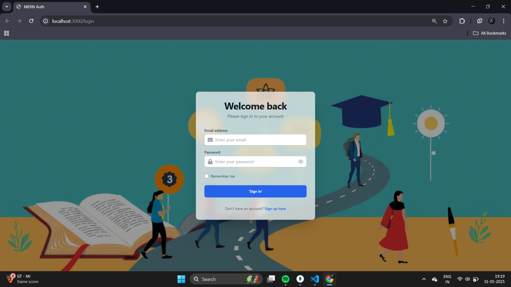
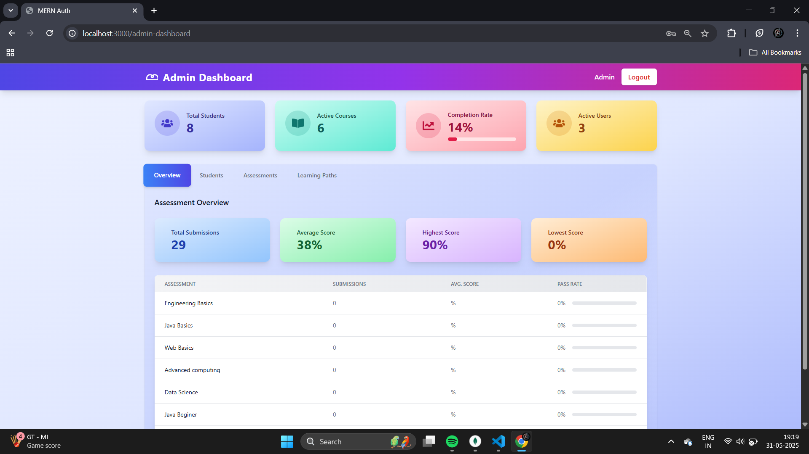
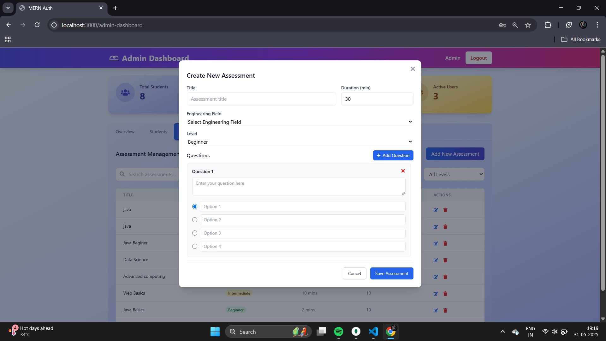
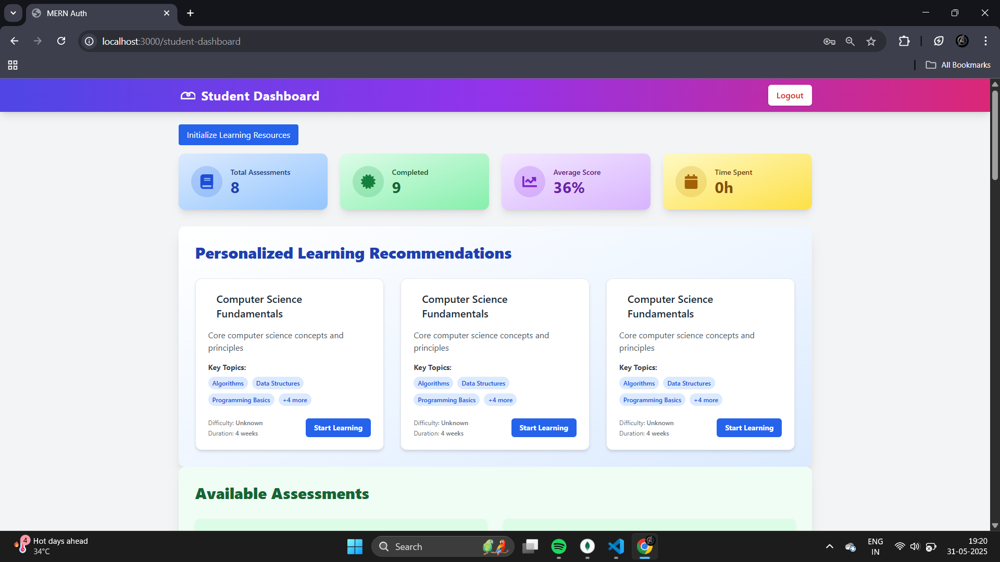
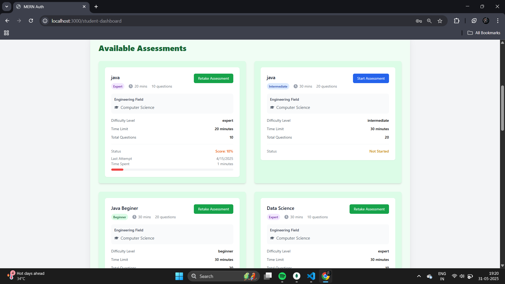
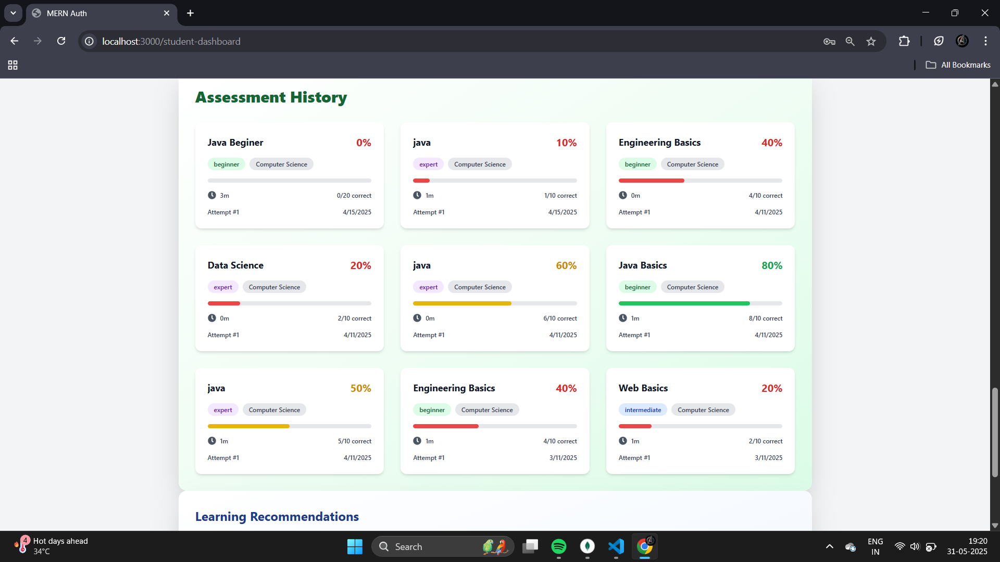
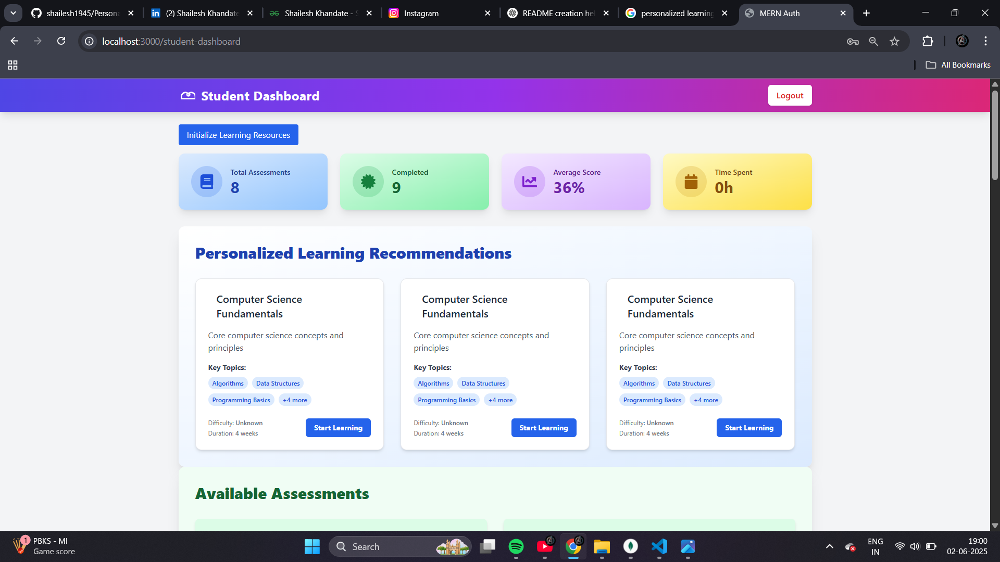
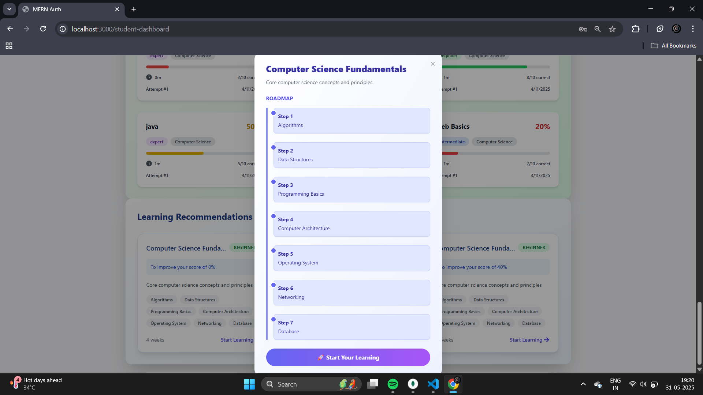
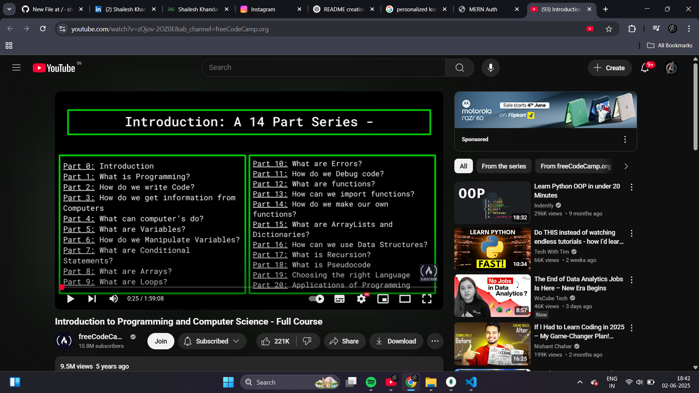

# Personal Path 🎯

**Personal Path** is a personalized learning pathway generator built for engineering students. Whether you're unsure about your interests or already know the technology you want to learn, this tool helps you find the best way forward with structured and smartly curated learning paths.

> Built with the **MERN Stack** — MongoDB, Express.js, React.js, and Node.js. Styled with **Tailwind CSS** and powered by **RESTful APIs**.

---

## 🚀 Features

- 🔍 **Assessment-Based Personalization**  
  Students can take an interactive assessment to receive customized learning pathways based on their interests and current knowledge.

- 🧭 **Direct Pathway Access**  
  Already know what you want to learn? Skip the quiz and head straight to detailed technology roadmaps.

- 🧠 **Topic-Level Breakdown**  
  Each pathway includes a structured breakdown of essential topics with curated content suggestions, like YouTube videos.

- 👨‍💼 **Admin Panel**  
  Admins can manage assessments, questions, and pathways using a dedicated dashboard.

---

## 🛠️ Tech Stack

- **Frontend:** React.js   
          
- **Backend:** Node.js, Express.js  
- **Database:** MongoDB  
- **Styling:** Tailwind CSS  
- **APIs:** RESTful API architecture  
- **Authentication:** JWT

---

## 📸 Screenshots & Demo

### 👨‍💼 Admin Panel

**1. Login Page**  


**2. Dashboard**  


**3. Create New Assessment**  


---

### 👨‍🎓 Student Section

**1. Login Page**  


**2. Dashboard**  


**3. Available Assessments**  


**4. Assessment History**  


**5. Personalized Learning Recommendations**  


**6. Generated Roadmap**  


**7. Video Example / Content**  


📽 **Live Demo Video:**  
[](https://www.youtube.com/watch?v=YOUR_VIDEO_ID)

---

## 🧑‍💻 How to Run Locally

1. **Clone the repository**
   ```bash
   git clone https://github.com/yourusername/personal-path.git
   cd personal-path
